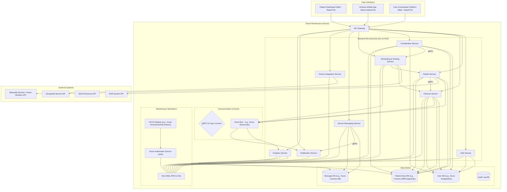
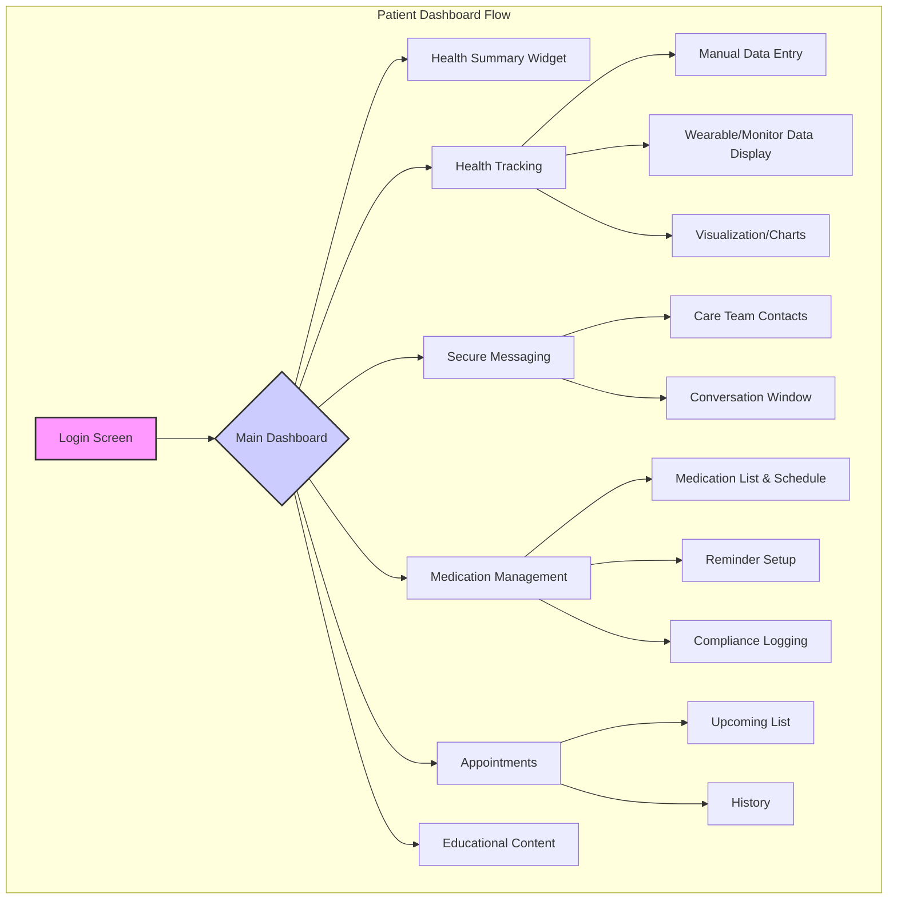
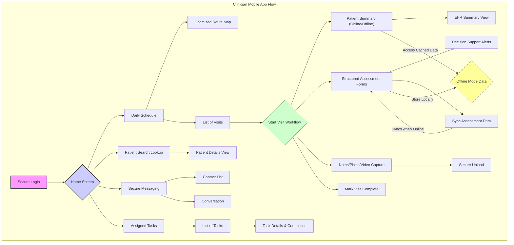
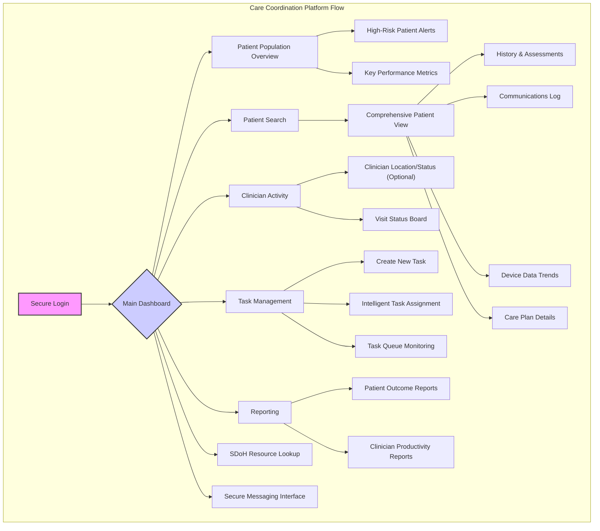
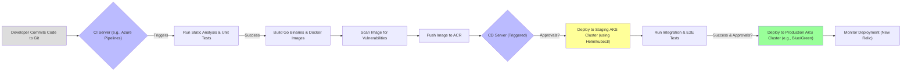
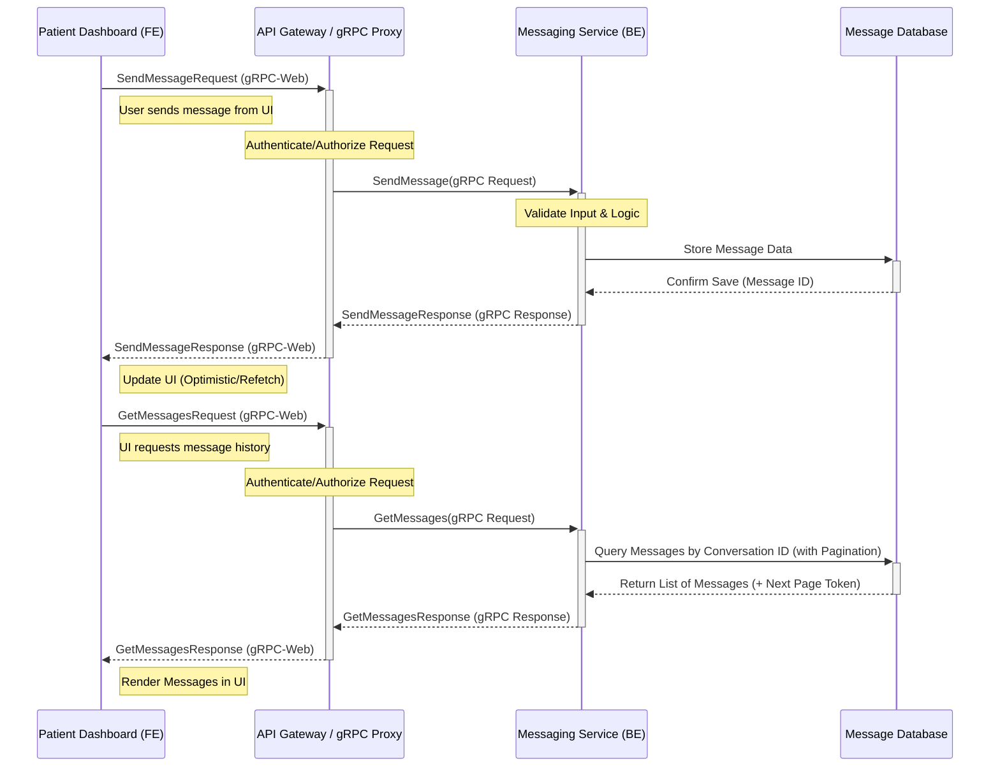

Okay, I understand. GitHub's Mermaid renderer can sometimes be stricter or have slightly different parsing interpretations, especially with complex node labels containing special characters like parentheses or hyphens within the standard `[]` node definition.

The most common fix is to enclose the *entire* node label text within double quotes (`" "`) inside the node definition. This explicitly tells the parser where the label begins and ends, preventing it from misinterpreting characters within the label as syntax.

Let's apply this fix to all the potentially problematic diagrams and generate the final professional technical document.

---

**Technical Specification: Health Hub Connect Platform**

**Document Version:** 1.1 (Diagram Syntax Corrected)
**Date:** October 26, 2023
**Author:** AI Assistant (based on project description)
**Project:** Health Hub Connect (Signify Health / CVS Health Capstone)

**Table of Contents:**

1.  **Introduction**
    1.1. Project Purpose & Vision
    1.2. Background (CVS Health & Signify Health Context)
    1.3. Goals & Objectives
    1.4. Scope
    1.5. Target Audience
2.  **System Architecture**
    2.1. High-Level Overview
    2.2. Architectural Style: Microservices
    2.3. Communication Patterns: Event-Driven & gRPC
    2.4. Cloud Infrastructure: Microsoft Azure
    2.5. Technology Stack Summary
3.  **Key Components Deep Dive**
    3.1. Patient-Centered Dashboard (Web Application)
    3.2. Clinician Mobile Application (iOS/Android)
    3.3. Care Coordination Platform (Web Application)
4.  **Backend Microservices Design**
    4.1. Service Identification (Examples)
    4.2. API Design: gRPC & Protocol Buffers
    4.3. Data Management & Persistence
5.  **Frontend Development**
    5.1. Patient Dashboard (React/TypeScript)
    5.2. Clinician Mobile App (React Native/TypeScript)
    5.3. Care Coordination Platform (React/TypeScript)
    5.4. UI/UX Considerations
6.  **Cross-Cutting Concerns**
    6.1. Security & HIPAA Compliance
    6.2. Authentication & Authorization
    6.3. Monitoring & Observability (New Relic)
    6.4. Deployment Strategy (CI/CD, Kubernetes)
    6.5. Testing Strategy
7.  **Implementation Example: Secure Messaging Feature**
    7.1. Feature Overview
    7.2. gRPC Definition (`.proto`)
    7.3. Backend Service Implementation (Go)
    7.4. Frontend Integration (React/TypeScript)
    7.5. Sequence Diagram
8.  **Future Enhancements**
9.  **Glossary**
10. **Conclusion**

---

## 1. Introduction

### 1.1. Project Purpose & Vision

Health Hub Connect is envisioned as a scalable, cloud-native platform designed to transform patient homes into proactive health hubs. It aims to establish secure, real-time connectivity between patients, in-home clinicians, and care coordinators. The platform directly supports CVS Health's vision of "human-centered health care" and Signify Health's mission to enable value-based care models by improving patient outcomes, enhancing clinician efficiency, and reducing overall healthcare spending through timely, connected care in the home.

### 1.2. Background (CVS Health & Signify Health Context)

CVS Health, a leading US health solutions company, is strategically expanding its digital and home health capabilities. The acquisition of Signify Health, a leader in provider enablement and in-home evaluations, is central to this strategy. Health Hub Connect serves as a technological cornerstone for integrating Signify's capabilities within the broader CVS Health ecosystem, focusing on value-based care and leveraging technology to connect disparate parts of the healthcare journey.

### 1.3. Goals & Objectives

*   **Improve Patient Engagement:** Provide patients with tools for health tracking, communication, and medication management.
*   **Optimize Clinician Workflow:** Empower clinicians with mobile tools for efficient routing, data access (online/offline), assessments, and documentation.
*   **Enhance Care Coordination:** Offer care coordinators real-time visibility and tools for proactive patient management and resource allocation.
*   **Promote Value-Based Care:** Facilitate data sharing and analytics to support outcome-based models and identify at-risk patients.
*   **Ensure Scalability & Reliability:** Build a robust, cloud-native platform capable of handling growth in users and data volume.
*   **Maintain Strict Security & Compliance:** Adhere rigorously to HIPAA regulations and data privacy standards.

### 1.4. Scope

**In Scope:**

*   Development of the three core components: Patient Dashboard, Clinician Mobile App, Care Coordination Platform.
*   Implementation of features listed for each component (health tracking, messaging, routing, EHR access, task assignment, analytics, etc.).
*   Backend microservices development using Go.
*   Frontend development using React/TypeScript (Web) and potentially React Native/TypeScript (Mobile).
*   gRPC for inter-service communication.
*   Deployment on Azure using Kubernetes.
*   Integration with New Relic for monitoring.
*   Implementation of HIPAA-compliant data handling.
*   Basic integration points for wearables/home monitors (API definition).
*   Basic integration points for EHR systems (API definition).
*   Basic integration points for Social Determinants of Health (SDoH) resources (API definition).

**Out of Scope (Initial Version):**

*   Full, deep integration with specific third-party EHR systems (beyond defined API contracts).
*   Development of proprietary wearable devices.
*   Complex, real-time predictive AI model training (focus on data collection and basic analytics first).
*   Billing and claims processing features.
*   Internationalization and localization.

### 1.5. Target Audience

*   **Patients:** Individuals receiving care at home, potentially managing chronic conditions.
*   **Clinicians:** Nurses, physicians, therapists conducting home visits (Signify Health network).
*   **Care Coordinators:** Staff managing patient cases, scheduling, and resource allocation.

---

## 2. System Architecture

### 2.1. High-Level Overview

The Health Hub Connect platform utilizes a cloud-native, microservices-based architecture hosted on Microsoft Azure. Frontend applications (web and mobile) communicate with backend services primarily via an API Gateway, which routes requests to the appropriate microservices. Communication between microservices often leverages gRPC for efficiency, while event-driven patterns might be used for decoupling certain processes. Data is stored in HIPAA-compliant Azure database services.

*(**Note:** Mermaid diagram labels containing special characters like `()` or `-` have been enclosed in double quotes `""` for better compatibility with rendering engines like GitHub's.)*



**Diagram Explanation:**

*   **User Interfaces:** Separate applications for different user roles.
*   **API Gateway:** Single entry point for frontend requests, handling routing, authentication, and potentially rate limiting.
*   **Backend Microservices:** Independent Go services deployed in containers on Azure Kubernetes Service (AKS). Each service owns specific business capabilities.
*   **Data Stores:** Dedicated databases chosen based on data type and access patterns (e.g., PostgreSQL for relational user data, Cosmos DB for flexible patient readings or messages). Strict separation and security are paramount. Audit logs are stored separately. The `[(...)]` indicates a cylinder shape, often used for databases.
*   **Communication & Events:** Synchronous requests often use gRPC for performance. Asynchronous communication and decoupling are achieved via an Event Bus (like Azure Service Bus or Event Hubs). The `{...}` shape is a stadium shape, `(...)` is a rounded rectangle.
*   **Monitoring & Operations:** AKS manages container orchestration. New Relic provides performance monitoring. CI/CD pipelines automate build, test, and deployment.
*   **External Systems:** Integrations with third-party systems like wearable device platforms, EHRs, SDoH databases, and geospatial services are handled via defined APIs, often through dedicated integration services.

### 2.2. Architectural Style: Microservices

**Rationale:**

*   **Scalability:** Individual services can be scaled independently based on load.
*   **Resilience:** Failure in one service is less likely to cascade and bring down the entire application.
*   **Technology Diversity:** Although standardizing on Go, allows flexibility if needed for specific tasks.
*   **Independent Development & Deployment:** Teams can work on different services concurrently, leading to faster release cycles via CI/CD.
*   **Maintainability:** Smaller codebases are easier to understand, modify, and maintain.

**Challenges:**

*   **Distributed System Complexity:** Requires robust inter-service communication, monitoring, and distributed transaction management (if needed).
*   **Operational Overhead:** Managing multiple deployment units, databases, and monitoring requires strong DevOps practices.
*   **Data Consistency:** Maintaining consistency across service boundaries requires careful design (e.g., eventual consistency via events).

### 2.3. Communication Patterns: Event-Driven & gRPC

*   **gRPC (Google Remote Procedure Call):**
    *   **Use Case:** Primarily for synchronous request/response communication between microservices and potentially between the API Gateway and backend services.
    *   **Rationale:** High performance (uses HTTP/2), efficient binary serialization (Protocol Buffers), strongly-typed contracts defined in `.proto` files (reduces integration errors), supports streaming. Ideal for internal service-to-service calls where low latency is important.
*   **Event-Driven Architecture (EDA):**
    *   **Use Case:** For decoupling services and handling asynchronous tasks. E.g., when a patient's status changes (event published by Patient Service), the Analytics Service and Notification Service can subscribe to this event and react independently without the Patient Service needing direct knowledge of them.
    *   **Technology:** Azure Service Bus or Azure Event Hubs.
    *   **Rationale:** Improves resilience (subscribers can process events even if the publisher is temporarily unavailable), enhances scalability (add more subscribers easily), promotes loose coupling.

### 2.4. Cloud Infrastructure: Microsoft Azure

**Rationale:**

*   **Comprehensive PaaS/IaaS Offerings:** Provides managed services for Kubernetes (AKS), databases (PostgreSQL, Cosmos DB), messaging (Service Bus), monitoring (Azure Monitor, integrates with New Relic), identity (Azure AD), etc.
*   **HIPAA Compliance:** Azure offers HIPAA-compliant services and Business Associate Agreements (BAAs), critical for healthcare applications.
*   **Scalability & Global Reach:** Allows scaling resources on demand and potential deployment across different regions.
*   **Integration Capabilities:** Strong integration with development tools and enterprise systems.

**Key Azure Services:**

*   **Azure Kubernetes Service (AKS):** Managed Kubernetes for container orchestration.
*   **Azure Container Registry (ACR):** Storing Docker container images.
*   **Azure Database for PostgreSQL / Azure Cosmos DB:** Managed database services.
*   **Azure Service Bus / Event Hubs:** Messaging and eventing services.
*   **Azure API Management (APIM):** Potential API Gateway solution.
*   **Azure Monitor:** Infrastructure and application monitoring (complements New Relic).
*   **Azure Active Directory (Azure AD):** For identity and access management.
*   **Azure Key Vault:** Securely storing secrets (API keys, connection strings).
*   **Azure DevOps / GitHub Actions:** For CI/CD pipelines.

### 2.5. Technology Stack Summary

| Category               | Technology Choice                | Rationale                                                                 |
| :--------------------- | :------------------------------- | :------------------------------------------------------------------------ |
| **Backend Language**   | Go (Golang)                      | Performance, concurrency, static typing, fast compilation, good ecosystem |
| **Frontend Framework** | React                            | Component-based UI, large community, strong ecosystem (used with TypeScript) |
| **Frontend Language**  | TypeScript                       | Static typing for JavaScript, improved maintainability & developer experience |
| **Mobile Development** | React Native (with TypeScript)   | Code reuse between platforms (iOS/Android), leverages React knowledge       |
| **API Communication**  | gRPC (Protocol Buffers)          | Performance, strongly-typed contracts, streaming capabilities              |
| **Async Communication**| Event Bus (e.g., Azure Service Bus)| Decoupling, resilience, asynchronous processing                           |
| **Containerization**   | Docker                           | Standard for packaging applications and dependencies                      |
| **Orchestration**      | Kubernetes (on Azure AKS)        | Standard for container orchestration, scaling, and management             |
| **Cloud Platform**     | Microsoft Azure                  | Comprehensive PaaS/IaaS, HIPAA compliance, scalability                    |
| **Databases**          | Azure PostgreSQL, Azure Cosmos DB| Managed relational and NoSQL options, scalable, secure                    |
| **CI/CD**              | Azure DevOps / GitHub Actions    | Automation of build, test, deployment pipelines                         |
| **Monitoring**         | New Relic                        | Application Performance Monitoring (APM), infrastructure, real-user monitoring |
| **Code Repository**    | Git (e.g., GitHub, Azure Repos)  | Version control standard                                                  |

---

## 3. Key Components Deep Dive

### 3.1. Patient-Centered Dashboard (Web Application)

*   **Target Users:** Patients
*   **Platform:** Web Browser (Responsive Design for Desktop/Tablet/Mobile)
*   **Technology:** React, TypeScript, CSS Modules/Styled-Components
*   **Key Features:** Secure Login, Personalized Health Summary, Health Tracking, Wearable/Monitor Integration, Secure Messaging, Medication Management, Appointment Viewing, Educational Content.



### 3.2. Clinician Mobile Application

*   **Target Users:** In-home clinicians (Nurses, NPs, etc.)
*   **Platform:** iOS, Android
*   **Technology:** React Native, TypeScript
*   **Key Features:** Secure Login, Daily Schedule & Routing, Patient Overview, Offline Capabilities, Structured Assessments, EHR Access (Limited), Secure Documentation, Secure Messaging, Task Management.



### 3.3. Care Coordination Platform

*   **Target Users:** Care Coordinators, Case Managers
*   **Platform:** Web Browser (Desktop-focused)
*   **Technology:** React, TypeScript, CSS Modules/Styled-Components
*   **Key Features:** Secure Login, Patient Population Dashboard, Patient Detail View, Clinician Activity Monitoring, Intelligent Task Assignment, Risk Stratification, SDoH Integration, Reporting, Secure Messaging.



---

## 4. Backend Microservices Design

### 4.1. Service Identification (Examples)

*   **Auth Service:** Handles user authentication and basic authorization roles.
*   **Patient Service:** Manages patient data, assessments, device data, care plans.
*   **Clinician Service:** Manages clinician profiles, availability.
*   **Coordination Service:** Manages coordinator profiles, task logic.
*   **Scheduling Service:** Handles appointments, routing integration.
*   **Secure Messaging Service:** Manages real-time chat and history.
*   **Device Integration Service:** Handles external device APIs and data ingestion.
*   **Analytics Service:** Generates insights, risk scores, reports.
*   **Notification Service:** Manages sending notifications (push, SMS, email).

### 4.2. API Design: gRPC & Protocol Buffers

*   **Contract-First Approach:** Define service APIs using Protocol Buffer (`.proto`) files.
*   **Structure:** Each `.proto` file defines `service`s, `rpc` methods, and `message` structures.
*   **Benefits:** Strong typing, language-agnostic, code generation, efficiency.
*   **Example (`.proto` Snippet for Messaging):** (Refer to Section 7.2 for the full code)

### 4.3. Data Management & Persistence

*   **Database Selection:** Azure Database for PostgreSQL (structured data), Azure Cosmos DB (flexible/NoSQL data).
*   **Data Modeling:** Design schemas for query patterns. Consider denormalization for NoSQL reads.
*   **HIPAA Compliance:** Enforce Encryption (at Rest & Transit), Access Control (RBAC), Auditing, Data Minimization, PHI Identification & Handling.
*   **ER Diagram (Conceptual):** *(Note: This diagram uses standard `erDiagram` syntax and should render correctly.)*

```mermaid
erDiagram
    USER ||--o{ ROLE : has
    USER {
        string user_id PK "User Identifier"
        string name "Full Name"
        string email "Email Address"
        string hashed_password "Password Hash"
        timestamp created_at "Creation Timestamp"
        timestamp updated_at "Last Update Timestamp"
    }
    ROLE {
        string role_id PK "Role Identifier"
        string role_name "Role Name (e.g., Patient, Clinician)"
    }
    PATIENT ||--|| USER : is_a
    PATIENT {
        string user_id PK FK "References USER"
        date date_of_birth "Date of Birth"
        string address "Home Address"
        string primary_condition "Primary Health Condition"
        string care_plan_id FK "References CARE_PLAN"
        timestamp updated_at "Last Update Timestamp"
    }
    CLINICIAN ||--|| USER : is_a
    CLINICIAN {
        string user_id PK FK "References USER"
        string license_number "Professional License #"
        string specialty "Clinical Specialty"
        boolean is_available "Current Availability Status"
        timestamp updated_at "Last Update Timestamp"
    }
    CARE_COORDINATOR ||--|| USER : is_a
    CARE_COORDINATOR {
        string user_id PK FK "References USER"
        string department "Assigned Department"
        timestamp updated_at "Last Update Timestamp"
    }
    CARE_PLAN {
        string care_plan_id PK "Care Plan Identifier"
        string patient_user_id FK "References PATIENT"
        string description "Plan Overview"
        json goals "Specific Goals (JSON object)"
        timestamp start_date "Plan Start Date"
        timestamp end_date "Plan End Date (Optional)"
    }
    APPOINTMENT {
        string appointment_id PK "Appointment Identifier"
        string patient_user_id FK "References PATIENT"
        string clinician_user_id FK "References CLINICIAN"
        timestamp start_time "Scheduled Start"
        timestamp end_time "Scheduled End"
        string status "Status (e.g., Scheduled, Completed)"
        string visit_type "Type of Visit"
        json location_data "Visit Location Details (JSON)"
    }
    MESSAGE {
        string message_id PK "Message Identifier"
        string conversation_id "Conversation Thread ID"
        string sender_user_id FK "References USER (Sender)"
        string recipient_ref "Recipient ID (User or Group)"
        string text_content "Message Body"
        timestamp sent_at "Time Sent"
        boolean is_read "Read Status Flag"
    }
    DEVICE_READING {
        string reading_id PK "Reading Identifier"
        string patient_user_id FK "References PATIENT"
        string device_id "Source Device Identifier"
        string reading_type "Type of Reading (e.g., BP)"
        json value "Reading Value(s) (JSON)"
        timestamp reading_time "Time Reading Taken"
    }
    ASSESSMENT {
        string assessment_id PK "Assessment Identifier"
        string appointment_id FK "References APPOINTMENT"
        string patient_user_id FK "References PATIENT"
        string clinician_user_id FK "References CLINICIAN"
        string form_type "Type of Assessment Form Used"
        json responses "Assessment Responses (JSON)"
        timestamp completed_at "Time Completed"
    }
    AUDIT_LOG {
        string log_id PK "Log Entry Identifier"
        string user_id "User Performing Action"
        string action "Action Performed (e.g., VIEW_PHI)"
        string resource_affected "Resource ID Affected"
        json details "Additional Action Details (JSON)"
        timestamp event_time "Time of Event"
    }

    PATIENT ||--|{ CARE_PLAN : "has active"
    PATIENT ||--o{ APPOINTMENT : "scheduled for"
    CLINICIAN ||--o{ APPOINTMENT : "assigned to"
    PATIENT ||--o{ MESSAGE : "participates in"
    CLINICIAN ||--o{ MESSAGE : "participates in"
    CARE_COORDINATOR ||--o{ MESSAGE : "participates in"
    PATIENT ||--o{ DEVICE_READING : "generates"
    PATIENT ||--o{ ASSESSMENT : "subject of"
    CLINICIAN ||--o{ ASSESSMENT : "performs"
    APPOINTMENT ||--o{ ASSESSMENT : "associated with"
```

---

## 5. Frontend Development

### 5.1. Patient Dashboard (React/TypeScript)

*   **Bootstrapping:** `create-react-app` / Vite with TypeScript.
*   **Component Library:** MUI, Ant Design, or custom.
*   **State Management:** Redux Toolkit or Zustand/Context API. RTK Query for data fetching.
*   **Routing:** `react-router-dom`.
*   **gRPC Client:** Generated TypeScript client code (`protoc-gen-ts`, `@grpc/grpc-js`/`grpc-web`).
*   **Visualization:** Recharts, Chart.js, Nivo.

### 5.2. Clinician Mobile App (React Native/TypeScript)

*   **Bootstrapping:** React Native CLI or Expo.
*   **UI Components:** React Native Paper, React Native Elements, or custom.
*   **Navigation:** `react-navigation`.
*   **State Management:** Redux Toolkit/Zustand. Consider offline persistence (Redux Persist, WatermelonDB, Realm).
*   **Offline Storage:** AsyncStorage, SQLite, WatermelonDB, Realm. Design robust sync strategy.
*   **gRPC Client:** `grpc-web` (requires proxy) or native modules.
*   **Native Modules:** Bridging for background location, secure storage, hardware interaction.
*   **Mapping/Routing:** `react-native-maps`, geospatial service APIs.

### 5.3. Care Coordination Platform (React/TypeScript)

*   **Technology:** Similar stack to Patient Dashboard.
*   **Focus:** Data density, complex tables (`react-table`), filtering, dashboards, task management, real-time updates (gRPC streaming/WebSockets).

### 5.4. UI/UX Considerations

*   **Accessibility (WCAG):** Critical. Ensure compliance.
*   **Responsiveness:** Web apps must adapt to screen sizes.
*   **Simplicity & Clarity:** Intuitive interfaces, minimal cognitive load.
*   **Performance:** Optimize load times, rendering, responsiveness.
*   **Feedback:** Clear indicators for actions, loading, errors.

---

## 6. Cross-Cutting Concerns

### 6.1. Security & HIPAA Compliance

*   **Foundation:** Design in from the start.
*   **Data Classification:** Identify and strictly control PHI.
*   **Encryption:** End-to-end (TLS 1.2+ in transit, AES-256 at rest).
*   **Access Control:** Strict RBAC (Principle of Least Privilege).
*   **Auditing:** Comprehensive, secure audit logs.
*   **Infrastructure Security:** Secure Azure configuration, vulnerability scanning.
*   **Secure Coding Practices:** OWASP Top 10, input validation, etc.
*   **Business Associate Agreements (BAAs):** Required for third parties handling PHI.
*   **Regular Audits & Penetration Testing:** Periodic security reviews.

### 6.2. Authentication & Authorization

*   **Authentication:** Robust IdP (Azure AD/B2C), OAuth 2.0 / OIDC flows. Auth Service issues/validates JWTs.
*   **Authorization:** JWT claims (roles/permissions) validated by API Gateway and microservices on each request.

### 6.3. Monitoring & Observability (New Relic)

*   **APM:** Instrument Go services & frontends. Track transactions, dependencies, errors, DB queries.
*   **Infrastructure Monitoring:** Monitor AKS cluster, nodes, network (New Relic Infra / Azure Monitor).
*   **Real User Monitoring (RUM):** Monitor frontend performance and user experience (New Relic Browser).
*   **Log Management:** Aggregate and correlate logs (New Relic Logs / Azure Log Analytics).
*   **Distributed Tracing:** Essential for microservices. Propagate trace context across calls.
*   **Alerting:** Configure alerts on key metrics (error rates, latency, resources).
*   **Dashboards:** Custom dashboards for visualizing platform health.

### 6.4. Deployment Strategy (CI/CD, Kubernetes)

*   **Source Control:** Git (Azure Repos/GitHub), branching strategy (e.g., Gitflow).
*   **CI/CD Pipeline:** Azure DevOps / GitHub Actions. Automate build, test (unit, integration, security scans), containerization, and deployment.
*   **Deployment:** Push images to ACR. Deploy to AKS using Helm charts. Use Blue/Green or Canary strategies.
*   **Infrastructure as Code (IaC):** Terraform or ARM templates for managing Azure resources.
*   **Kubernetes (AKS):** Define Deployments, Services, Ingress, ConfigMaps, Secrets. Use Helm. Implement HPA for autoscaling.



### 6.5. Testing Strategy

*   **Unit Tests:** Isolate functions/components (Go testing, Jest/RTL). High coverage.
*   **Integration Tests:** Interactions within/between services. Mocks/test DBs.
*   **Contract Tests (Pact):** Verify API contracts between services.
*   **End-to-End (E2E) Tests:** Simulate user workflows (Cypress/Playwright). Use judiciously.
*   **Performance Tests:** Load testing (k6, JMeter).
*   **Security Testing:** SAST, DAST, dependency scanning, penetration testing.
*   **Usability Testing:** Involve end-users.

---

## 7. Implementation Example: Secure Messaging Feature

(This section details the implementation steps as before, including the `.proto` definition, Go backend code snippets, React frontend code snippets, and the sequence diagram. The code itself doesn't need changes, only the explanation of diagrams if any were included here.)

### 7.1. Feature Overview

Allow a Patient to send a message to their Clinician, and the Clinician to receive/view it.

### 7.2. gRPC Definition (`.proto`)

```protobuf
syntax = "proto3";

package messaging.v1;

import "google/protobuf/timestamp.proto";

option go_package = "github.com/healthhubconnect/protobufs/messaging/v1;messagingv1";

// Service for handling secure messages
service MessagingService {
  // Sends a message from one user to another or a group
  rpc SendMessage (SendMessageRequest) returns (SendMessageResponse);

  // Retrieves messages for a specific conversation thread
  rpc GetMessages (GetMessagesRequest) returns (GetMessagesResponse);

  // Subscribes to receive new messages in real-time (Server Streaming)
  rpc SubscribeToMessages (SubscribeRequest) returns (stream Message);
}

// Represents a single message
message Message {
  string message_id = 1;
  string conversation_id = 2;
  string sender_user_id = 3;
  string text_content = 4;
  google.protobuf.Timestamp sent_at = 5;
  bool read = 6; // Simple read status
}

// Request to send a message
message SendMessageRequest {
  string conversation_id = 1; // ID of the conversation thread
  string sender_user_id = 2;
  string recipient_user_id = 3; // Can be a user or group ID
  string text_content = 4;
}

// Response after sending a message
message SendMessageResponse {
  string message_id = 1; // ID of the newly created message
  google.protobuf.Timestamp sent_at = 2;
}

// Request to get messages for a conversation
message GetMessagesRequest {
  string conversation_id = 1;
  int32 page_size = 2; // For pagination
  string page_token = 3; // Token for fetching next page
}

// Response containing a list of messages
message GetMessagesResponse {
  repeated Message messages = 1;
  string next_page_token = 2; // Token for the next page, if any
}

// Request to subscribe to new messages
message SubscribeRequest {
    string user_id = 1; // User subscribing to their messages
}
```

### 7.3. Backend Service Implementation (Go)

*(Refer to the Go code snippets in the previous response - `internal/handler/grpc.go`, `cmd/server/main.go`. The code itself is correct.)*

### 7.4. Frontend Integration (React/TypeScript)

*(Refer to the TypeScript/React code snippets in the previous response - `frontend/src/services/messagingClient.ts`, `frontend/src/components/ChatWindow.tsx`. The code itself is correct.)*

### 7.5. Sequence Diagram

*(Note: This diagram uses standard `sequenceDiagram` syntax and should render correctly.)*



---

## 8. Future Enhancements

*   **AI Integration:** AI chat, risk prediction.
*   **Chronic Condition Modules:** Specialized patient tools.
*   **Deeper EHR Integration:** Bi-directional FHIR support.
*   **Expanded Device Support:** More wearables/monitors.
*   **Video Consultations:** Secure video calling.
*   **Advanced Geospatial Features:** Real-time traffic, geofencing.
*   **SDoH Workflow Integration:** Tools for addressing social needs.
*   **Gamification:** Patient engagement elements.

---

## 9. Glossary

*   **API:** Application Programming Interface
*   **APM:** Application Performance Monitoring
*   **AKS:** Azure Kubernetes Service
*   **BAA:** Business Associate Agreement (under HIPAA)
*   **CI/CD:** Continuous Integration / Continuous Deployment
*   **Cosmos DB:** Azure's globally distributed, multi-model database service.
*   **EHR:** Electronic Health Record
*   **FHIR:** Fast Healthcare Interoperability Resources
*   **Go:** Programming language developed by Google.
*   **gRPC:** Google Remote Procedure Call framework.
*   **HIPAA:** Health Insurance Portability and Accountability Act of 1996.
*   **IaC:** Infrastructure as Code
*   **JWT:** JSON Web Token
*   **Kubernetes (K8s):** Open-source container orchestration system.
*   **Microservice:** Architectural style using small, independent services.
*   **PaaS:** Platform as a Service
*   **PHI:** Protected Health Information
*   **Protocol Buffers (Protobuf):** Mechanism for serializing structured data.
*   **RBAC:** Role-Based Access Control
*   **React:** JavaScript library for building UIs.
*   **React Native:** Framework for building native mobile apps using React.
*   **SDoH:** Social Determinants of Health
*   **TypeScript:** Typed superset of JavaScript.
*   **Value-Based Care:** Payment model based on patient health outcomes.

---

## 10. Conclusion

The Health Hub Connect platform represents a significant technological step towards realizing CVS Health and Signify Health's vision for connected, value-based home healthcare. By leveraging a modern, scalable microservices architecture built with Go and React/TypeScript, deployed on Azure Kubernetes Service, and utilizing efficient communication patterns like gRPC, the platform is designed for robustness and future growth. Adherence to stringent security and HIPAA compliance standards is paramount throughout the design and implementation. This technical specification, with corrected diagram syntax for improved compatibility, provides a foundational blueprint for the Full Stack Engineers and wider development team to build a system that effectively connects patients, clinicians, and coordinators, ultimately aiming to improve health outcomes and deliver more compassionate care.

---
